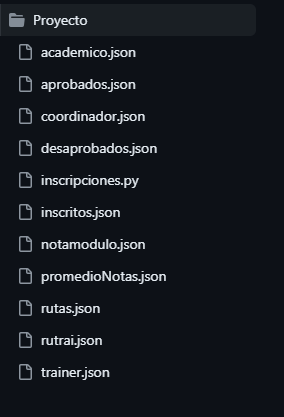

# Proyecto Filtro Python

En este respositorio encontrarás una carpeta con archivos que se unen para realizar de manera ordenada y efectiva el proyecto.
Este proyecto consiste en crear un programa que le permita llevar el seguimiento académico de todos los campers que se encuentran matriculados en el programa intensivo de programación.

## Características del proyecto

1. El programa  permite a las personas encargadas de procesar las inscripciones
a el programa; la información que se tiene por cada ***camper*** es la siguiente : 

- #de identificación.
- Nombres.
- Apellidos.
- Dirección.
- Acudiente.
- Teléfonos de contacto(# de celular y #fijo).
- Estado (En proceso de ingreso, Inscrito, Aprobado,Cursando, Graduado, Expulsado, Retirado).
- Riesgo.

2. Campus cuenta con diferentes rutas de entrenamiento las cuales deben cumplir los candidatos que superen la prueba inicial. 

Las rutas son las siguientes: 

- Ruta NodeJS
- Ruta Java
- Ruta NetCore

3. El programa debe tener tres roles: **Camper, Trainer y Coordinador**, donde esta última persona cuenta con una opción en el programa que le permita registrar la nota de los ***campers*** que se han registrado y con ello cambiar su estado a “**Aprobado**”. La prueba es aprobada si el promedio entre la nota teórica y la nota practica es mayor o igual a 60.

4. Campus cuenta con diferentes áreas de entrenamiento en la cuales los ***campers*** aprenden los diferentes stacks tecnológicos dependiendo de las rutas de entrenamiento. Por el momento se cuenta con tres áreas de entrenamiento con una capacidad máxima de 33 **campers (Tener en cuenta que hay clases cada 4 horas)**.

5. La **coordinación académica** puede crear nuevas rutas de entrenamiento las cuales contienen la siguiente información (módulos):
- Fundamentos de programación (Introducción a la algoritmia, PSeInt y Python)
- Programación Web (HTML, CSS y Bootstrap).
- Programación formal (Java, JavaScript, C#).
- Bases de datos (Mysql, MongoDb y Postgresql). Cada ruta tiene un SGDB principal y un alternativo.
- Backend (NetCore, Spring Boot, NodeJS y Express).

6. Los ***campers*** que pasaron de “**Inscritos**” a “**Aprobados**” podrán ser asignados a cualquiera de las rutas que se han creado previamente. Se debe tener en cuenta que no se puede exceder la capacidad de cada una de las áreas de entrenamiento.

7. **CampusLands** cuenta con **Trainers** expertos encargados de dirigir cada una de las rutas de entrenamiento. Esto quiere decir que a cada uno se le puede asignar diferentes rutas de entrenamiento teniendo en cuenta su horario.

8. La **coordinación académica** cuenta con un módulo de matriculas que le permita
asignar los ***campers*** aprobados, **trainer** encargado, ruta de entrenamiento asignada, fecha de inicio, fecha finalización y salón de entrenamiento.

9. Periódicamente los ***campers*** son evaluados para conocer las habilidades adquiridas durante el proceso de entrenamiento, donde cuando finaliza cada modulo los ***campers*** deben presentar una prueba teórica y una prueba practica. Esta prueba es considerada como aprobada si el promedio de las dos dan un valor mayor o igual a 60. Aqui la prueba teórica tiene un peso de 30% y la prueba practica tiene un peso del 60%, donde durante dicho proceso el **Trainer** realizará quizes, trabajos los cuales tienen un peso del 10%. Al finalizar el proceso de evaluación se considerará aprobado el modulo si la nota final es mayor a 60.

10. La **coordinación académica** cuando finaliza cada uno de los módulos de las rutas
evalúa el rendimiento de cada uno de los **campers** teniendo en cuenta la nota obtenida en cada modulo. Si la nota es menor a 60 el **camper** queda en rendimiento bajo lo cual genera un llamado de atención. Por esto mismo, se deberá permitir consultar los **campers** que se encuentren en riesgo alto.

11. El módulo de reportes tiene las siguientes funcionalidades:
- Listar los **campers** que se encuentren en estado de inscrito.
- Listar los **campers** que aprobaron el examen inicial.
- Listar los entrenadores que se encuentran trabajando con **CampusLands**.
- Listar los **campers** que cuentan con bajo rendimiento.
- Listar los **campers** y **trainers** que se encuentren asociados a una ruta de entrenamiento.
- Mostrar cuantos **campers** perdieron y aprobaron cada uno de los módulos teniendo en cuenta la ruta de entrenamiento y el entrenador encargado.
  
## Instalación 

1. Clona el repositorio: Utiliza el comando "git clone" seguido de la URL del repositorio para clonar el proyecto en tu computadora local.

2. Abre la carpeta del proyecto: Navega a la carpeta donde se clonó el proyecto y ábrela en tu editor de código favorito.

3. Abre el archivo main.py: Busca el archivo Python principal (usualmente "main.py") y ejecútalo en la terminal.

## Estructura



|Nombre del Archivo|Función|
|--|--|
|```academico.json```| Este archivo json contiene los datos de los estudiantes de cada salón.|
|```aprobados.json```| Este archivo json conetiene a los estudiantes que han sido aprobados.|
|```coordinador.json```| Este archivo json conetiene los datos personales del coordinador.|
|```desaprobaddos.json```| Este archivo json contiene a los estudiantes que han sido desaprobados.|
|```inscripciones.py```| Este archivo es el princpal, ya que une todos los archivos json para completar con éxito nuestro proyecto.|
|```inscritos.json```| Este archivo json contiene a todos los estudiantes que están cursando en CampusLands.|
|```notamodulo.json```| Este archivo json contiene a todas las notas que el estudiante obtuvo en cada módulo.|
|```promedioNotas.json```| Este archivo json contiene el promedio total del estudiante.|
|```rutas.json```| Este archivo json contiene las rutas disponibles en el curso.|
|```trainer.json```| Este archivo json contiene a todos los profesores de Campusalands.|

### Contacto
*Correo eléctronico*
* valerie01liz01@gmail.com
* jesusgustamante08@gmail.com

Este proyecto fue desarrollado por Valerie Lasso y Jesus Bustamante para CampusLand con el fin de completar el curso de python.
